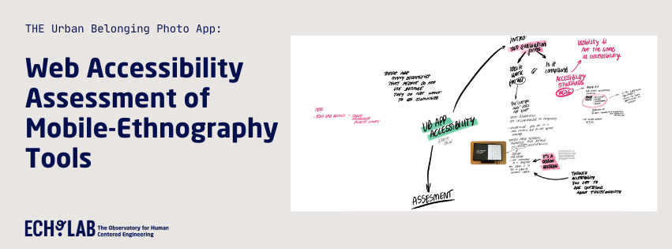

### Web Accessibility Assessment of Tools for Mobile Ethnography Workshop - The Urban Belonging Photo App

In this ECHO Lab project, we worked together with the team behind the [Urban Belonging Project](https://urbanbelonging.com), the developer of the Urban Belonging Photo App, Iain Kettles, and the digital accessibility consulants Anne Thyme and Stein Erik Skotsterra from [UseIt](https://useit-consulting.dk) 

During the process of the web accessibility assessment with the development team, we invited colleagues from the research group at the division, to partake in a workshop that uses the UB App as a case, but also addresses web accessibility and the importance thereof when using and working on digital tools.
In a one-day workshop we went through the digital accessibility assessment of the app. 

You can find the  workshop description in this pdf Guide. [Download PDF Guide](https://github.com/ECHOlab-DTU/UB-App-Accessibility-Development/blob/main/EXAMPLE%20UB%20APP.pdf)

---

### Introduction to the Project & the App 

The Urban Belonging Project is an award winning research project conducted by architects, social scientists and software engineers. Read all about it [here](https://urbanbelonging.com) 

The initial project (2020- 2023) combined digital, participatory and ethnographic methods to study how different communities relate to and belong in urban spaces. One of the
digital methods developed for this project is “The Urban Belonging Photo App” (UB App) . This open- source toolkit was designed by the developer Iain K ettles
in close collaboration with the project members.
In the app, research participants can take pictures, annotate, share, and comment on their own and pictures taken by others. The data collected through
the app is available for analysis through a desktop dashboard interface that participants and researchers can access.

The app was initially implemented and used by six organizations representing marginalized communities in Copenhagen. The final user group consisted of 32 citizens 
representing LGBT Q+ community members, Deaf people, people withan ethnic minority background, people who identified as mentally vulnerable, physically disabled, international expats, 
and people who were unhoused.

Over a research period of three months, users created over 1400 photos and 200 photo routes.

---

### Step 1: What is web accessibility?

We begin with a presentation about web accessibility. 
You can read about guidelines for web accessibility [here](https://www.w3.org/WAI/fundamentals/accessibility-intro/)

---

### Step 2: How to assess an app for digital accessibility

Stein Erik Skotsterra, digital accessibility consultant and expert for assessment of websites and digital interfaces using assistive technologies, took us through his experience of 
using the UB App with a screenreader.

---

### Step 3: Collective annotation of the prototype

Using the Figma prototype of the app for this exercise, all workshop participants annotated the protoype with the accessibility barriers that Stein Erik encountered.

---

### Step 4: Translating issues to requirements

Annotations were written on post-it's with reference to the respective feature in the app.
We collected all annotations on the whiteboard and distributed them according to the type of accessibility barrier identified.
We end up with several categories: visual contrast, semantic accessibility elements, onboarding-flow to the app, keyboard navigation, alternative text for images, 
availability of multimodal information, fontsize and readability.

----

### Step 5: Digital Accessibility in your own research

After the exercises using the UB App as a case, all participants present an example of their research and a point of reflection about digital accessibility that was new to them.
In plenum, tips and strategies for future research projects are discussed and Anne Thyme and Stein Erik share tools and information sources for assessing research projects and tools in the future.

----

### List of tools:

[W3C web accessibility guidelines](https://www.w3.org/WAI/fundamentals/accessibility-intro/)
[Website contrast checker](https://accessibleweb.com/color-contrast-checker/)
[UseIT website for digital accessibility consultancy](https://useit-consulting.dk)

