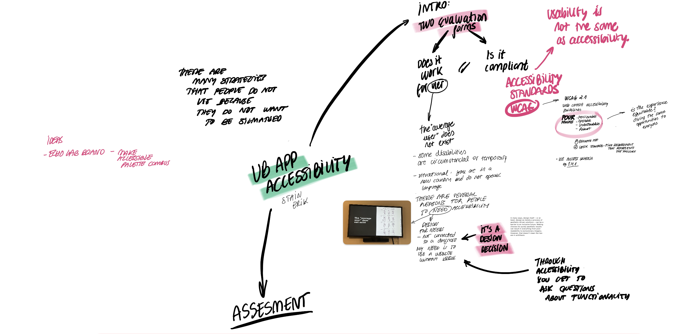

# Web Accessibility Assessment of Tools for Mobile Ethnography Workshop - The Urban Belonging Photo App

### Introduction to the App

[Download PDF Guide](https://github.com/ECHOlab-DTU/UB-App-Accessibility-Development/blob/main/EXAMPLE%20UB%20APP.pdf)

### Steps in the assessment workshop

